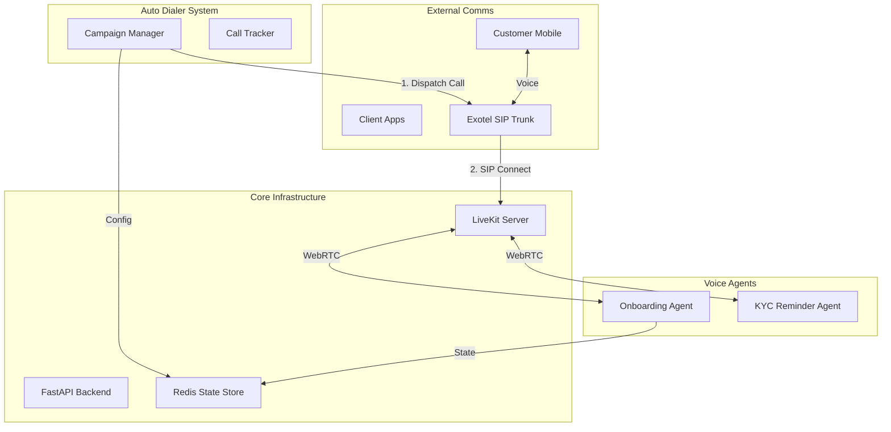

# 🤖 Freo Speech - AI-Powered Voice Automation Platform [PRIVATE ENVIRONMENT]

A production-grade conversational AI platform built for **high-scale customer engagement**, featuring an **orchestrator-driven ReAct architecture** for complex data collection and a **smart auto-dialing system** for outbound campaigns. Built with **LiveKit**, **OpenAI**, **Exotel**, and **Gemini**.

---

## 🏗️ System Architecture

The platform consists of two main pillars: **Real-time Voice Agents** and the **Auto Dialer Campaign Manager**.

> 🏗️ **Editable Architecture Diagram**: The master design file is available at `assets/Voicebot core infrastructure.drawio`. You can edit this file using [Draw.io](https://app.diagrams.net/).



## 🚀 Core Modules

### 1. 🤖 Voice Agents

#### **Onboarding Agent (Riya)**
*for Complex Data Collection*
- **Architecture**: Orchestrator-driven ReAct Loop.
- **Goal**: Collects 7 specific data points (Name, DOB, PAN, etc.).
- **Features**:
    - Real-time intent classification (Gemini 1.5 Flash).
    - Intelligent validation with error recovery.
    - **Proactive UI Helpers**: Sends visual cues to the client alongside voice.
- **State Management**: LiveKit `userdata` for low latency.

#### **KYC Reminder Agent (AIP to Line)**
*for Outbound Notifications*
- **Architecture**: Post-Processing Centric.
- **Goal**: Remind customers with approved limits to complete KYC.
- **Features**:
    - **Smart Voicemail Detection**: Uses `trigger_voicemail` tool to leave messages.
    - **Post-Call Analytics**: LLM analyzes the transcript *after* the call to determine outcomes.
    - **Simplified Tools**: Focus on call state (in-progress/completed) rather than complex flow control.

---

### 2. 📞 Auto Dialer System

A robust campaign manager designed to handle high-volume outbound calling via Exotel.

- **Dynamic Concurrency**: Automatically scales dial-out rate (up to 50 concurrent calls) based on active lines.
- **Smart Retries**: Automatically re-queues failed or busy numbers.
- **Redis Tracking**: Real-time state monitoring (In-Progress, Ringing, Failed).
- **Campaign Management**: Supports multiple iterations and CSV-based contact lists.

---

## 📁 Project Structure

```
freo-speach/
├── agents/                               # 🧠 Voice Agent Implementations
│   ├── onboarding/                       # Riya: Complex Onboarding Agent
│   │   ├── components/                   # ReAct pipeline (Intent, Validation)
│   │   └── validation/                   # Field validators & UI helpers
│   └── aip_to_line/                      # KYC Report Agent
│       └── aip_to_line_agent.py          # Simplified outbound logic
│
├── auto_dialer/                          # 📞 Outbound Campaign System
│   ├── auto_dialer.py                    # Main campaign runner
│   ├── campaign.py                       # Batch orchestration logic
│   └── outbound_caller.py                # Exotel API integration
│
├── core/                                 # 🔧 Shared Infrastructure
│   ├── livekit_manager.py                # LiveKit connection logic
│   ├── redis_session_manager.py          # Shared state management
│   └── config.py                         # Environment configuration
│
├── api/                                  # 🌐 REST API
│   └── routes.py                         # Session start/stop endpoints
│
└── deployment/                           # 🚢 Deployment Resources
    └── EC2-DEPLOYMENT-STEPS.md
```

---

## 🛠️ Quick Start

### Prerequisites
- Python 3.9+
- LiveKit Server (or Cloud)
- Redis Server
- **API Keys**: OpenAI, Gemini, Deepgram, Exotel

### Installation

1. **Clone the repository**
   ```bash
   git clone <repository>
   cd freo-speach
   pip install -r requirements.txt
   ```

2. **Configure Environment**
   Copy `.env.example` to `.env` and configure:

   ```bash
   # Core Keys
   OPENAI_API_KEY="sk-..."
   GEMINI_API_KEY="AIza..."
   DEEPGRAM_API_KEY="Tk-..."
   
   # LiveKit
   LIVEKIT_URL="wss://..."
   LIVEKIT_API_KEY="devkey"
   LIVEKIT_API_SECRET="secret"
   
   # Exotel (For Outbound)
   EXOTEL_ACCOUNT_SID="freo123"
   EXOTEL_API_KEY="exo_key"
   EXOTEL_API_TOKEN="exo_token"
   EXOTEL_SUBDOMAIN="api.exotel.com"
   
   # Auto Dialer Settings
   AUTO_DIALER_PARALLEL_THRESHOLD=20
   AUTO_DIALER_WAIT_TIME=6
   ```

3. **Start Core Services**
   ```bash
   # Terminal 1: LiveKit (if local)
   livekit-server --dev --bind 0.0.0.0

   # Terminal 2: API Server
   python main.py

   # Terminal 3: Agent Worker
   python worker.py
   ```

---

## 🎮 Usage Modes

### Mode A: Single Session (API Interactivity)
Best for testing individual agents or handling inbound traffic.

**Start Onboarding Session:**
```bash
curl -X POST http://localhost:8003/api/v1/start_session \
  -H "X-API-Key: your_key" \
  -d '{"user_id": "test_user", "config": {"agent_type": "onboarding"}}'
```

### Mode B: Campaign Mode (Auto Dialer)
Best for running outbound call lists.

**Running a Campaign:**
```bash
# Syntax: python auto_dialer/auto_dialer.py <csv_file> <iterations> <exophones>

python auto_dialer/auto_dialer.py campaign_data.csv 1 +918012345678
```

**CSV Format (`campaign_data.csv`):**
| customer_external_id | customer_name | customer_mobile_number | approved_limit |
|----------------------|---------------|------------------------|----------------|
| CUST_001             | Aditi Rao     | +919876543210          | 50000          |

---

## 🔌 API & Event Reference

### Data Channel Events (Onboarding)
The Onboarding agent uses a standardized data protocol for UI synchronization.

- **`onboarding.form.request`**: Agent requests a field from the user. Contains input type, guidance, and validation rules.
- **`onboarding.form.status`**: Status of the last input (success/failure) with error messages.
- **`communication.text.display`**: Subtitles/text to display on screen ensuring Voice-Text sync.

### Session Lifecycle
1. **Init**: Room created, Token generated.
2. **Connect**: Agent joins, greets user.
3. **Loop**: ReAct loop (Think -> Act -> Speak) or Post-Processing.
4. **End**: Session marked `completed` or `disconnected`. Data saved to DB.

---

## 🚧 Development & Debugging

### Logging
Logs are structured with strict prefixes for component isolation:
- `FREO AI | ONBOARDING | ...`
- `AGENTS | AIP_TO_LINE | ...`
- `AUTO_DIALER | ...`

### Common Commands
```bash
# Check Active Calls in Redis
redis-cli KEYS "auto_dialer:in_progress:*" | wc -l

# Check LiveKit Rooms
curl http://localhost:7880/dashboard
```

---

## 🔒 Security
- **API Authentication**: All endpoints protected by `X-API-Key`.
- **Masking**: PII is masked in application logs.
- **Isolation**: Each session runs in a dedicated LiveKit room.

---
**Maintained by Freo Engineering**
*For detailed deployment instructions, see `deployment/EC2-DEPLOYMENT-STEPS.md`*